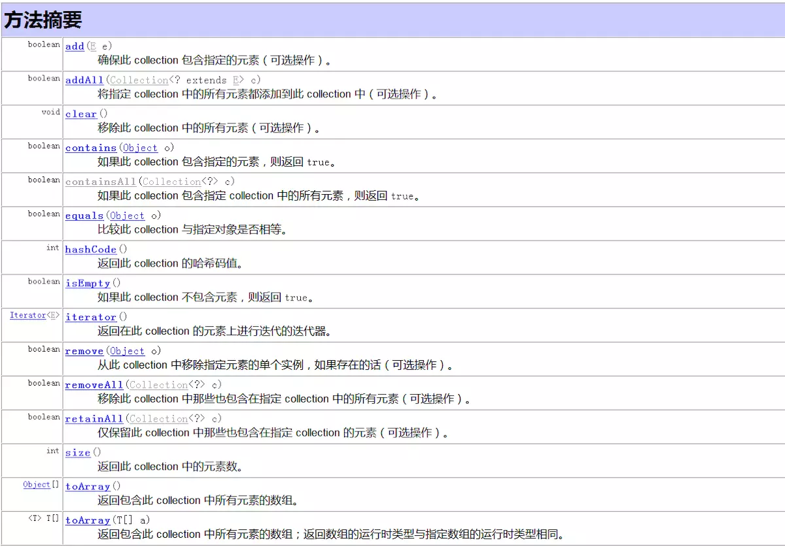

# Java基础知识-集合

# 简介
集合，就是装载拥有相同特性的一个Java容器。在这个容器里面只能放对象，对于基本类型，需要将其包装成对象类型之后才能放到容器里面。很多时候拆包装和解包装能够自动完成。这虽然会导致额外的性能和空间开销，但简化了设计和编程。

当提到 比较 集合的 区别的时候可以从 
1. 是否允许null
2. 是否允许集合内元素重复
3. 是否有序
4. 是否线程安全
> todo 这个点有点问题

以上四个方面可以去解释各个集合的不同。当然也可以从这四个方面找出更加细致的点去论证。比如 线程安全 与否，就能够跟 效率高低挂上钩。


# 泛型
类型的参数化  
Java容器能够容纳任何类型的对象，这一点表面上是通过泛型机制完成，Java泛型不是什么神奇的东西，只是编译器为我们提供的一个“语法糖”，泛型本身并不需要Java虚拟机的支持，只需要在编译阶段做一下简单的字符串替换即可。实质上Java的单继承机制才是保证这一特性的根本，因为所有的对象都是Object的子类，容器里只要能够存放Object对象就行了。  

事实上，所有容器的内部存放的都是Object对象，泛型机制只是简化了编程，由编译器自动帮我们完成了强制类型转换而已。JDK 1.4以及之前版本不支持泛型，类型转换需要程序员显式完成。

## 泛型的通配符(?)：
### 上限限定：
比如定义方法的时候出现，public void getFunc(List<? extends Animal> an)，
那么表示这里的参数可以传入Animal，或者 Animal的子类
### 下限限定: 
比如定义方法的时候出现，public void getFunc(Set<? super Animal> an ),
那么表示这里的参数可以传入Animal，或者Animal的父类


# 接口与实现
## 接口
为了规范容器的行为，统一设计，Java 定义了14 种容器接口

其中又分为Colletcion和Map两大类，  
Colleciton是Set,List,Queue集合接口的父接口,

## Collection
接口中定义了多种方法可供其子类进行实现，以实现数据操作。由于方法比较多，就偷个懒，直接把JDK文档上的内容搬过来。

  
可以看出Collection用法有：添加元素，删除元素，返回Collection集合的个数以及清空集合等。
其中重点介绍iterator()方法，该方法的返回值是Iterator<E>。


## 迭代器（Iterator）
Collection继承了Iterable接口，迭代器（Iterator）为我们提供了遍历容器中元素的方法。只有容器本身清楚容器里元素的组织方式，因此迭代器只能通过容器本身得到。每个容器都会通过内部类的形式实现自己的迭代器。

## 使用 Iterator 遍历集合元素
Iterator 接口中定义了两个方法
1. boolean hasNext() 如果仍有元素可以迭代，则返回 true
2. E next(); 返回迭代的下一个元素。
```
public class IteratorExample {
    public static void main(String[] args){
        //创建集合，添加元素  
        Collection<Day> days = new ArrayList<Day>();
        for(int i =0;i<10;i++){
            Day day = new Day(i,i*60,i*3600);
            days.add(day);
        }
        //获取days集合的迭代器
        Iterator<Day> iterator = days.iterator();
        while(iterator.hasNext()){//判断是否有下一个元素
            Day next = iterator.next();//取出该元素
            //逐个遍历，取得元素后进行后续操作
            .....
        }
    }

}
```

## Set
Set集合不允许包含相同的元素，如果试图把两个相同的元素加入同一个Set集合中，则添加操作失败，add()方法返回false，且新元素不会被加入。

## List
List集合代表一个元素有序、可重复的集合，集合中每个元素都有其对应的顺序索引。List集合允许使用重复元素，可以通过索引来访问指定位置的集合元素 。List集合默认按元素的添加顺序设置元素的索引，例如第一个添加的元素索引为0，第二个添加的元素索引为1......
List作为Collection接口的子接口，可以使用Collection接口里的全部方法。而且由于List是有序集合，因此List集合里增加了一些根据索引来操作集合元素的方法。


## Queue 
Queue用户模拟队列这种数据结构，队列通常是指“先进先出”(FIFO，first-in-first-out)的容器。队列的头部是在队列中存放时间最长的元素，队列的尾部是保存在队列中存放时间最短的元素。新元素插入（offer）到队列的尾部，访问元素（poll）操作会返回队列头部的元素。通常，队列不允许随机访问队列中的元素。

# Map
Map用户保存具有映射关系的数据，因此Map集合里保存着两组数，一组值用户保存Map里的key,另一组值用户保存Map里的value，key和value都可以是任何引用类型的数据。Map的key不允许重复，即同一个Map对象的任何两个key通过equals方法比较总是返回false。   
如下图所描述，key和value之间存在单向一对一关系，即通过指定的key,总能找到唯一的、确定的value。从Map中取出数据时，只要给出指定的key，就可以取出对应的value。