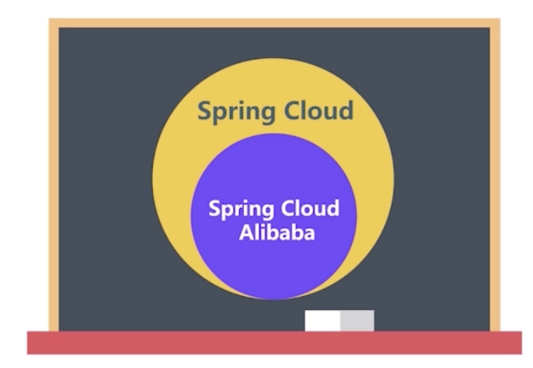
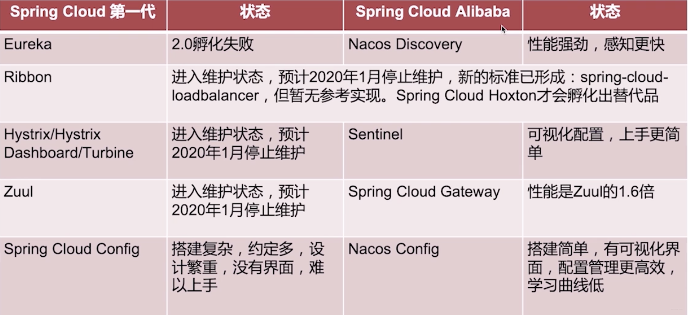

# 简介
Spring Cloud Alibaba 是阿里巴巴公司结合自身微服务实践 开源的分布式开发工具集，此项目包含开发分布式应用微服务的必需组件，方便开发者通过Spring Cloud 编程模型轻松使用这些组件来开发分布式应用服务。  
依托 Spring Cloud Alibaba，您只需要添加一些注解和少量配置，就可以将 Spring Cloud 应用接入阿里微服务解决方案，通过阿里中间件来迅速搭建分布式应用系统。Spring Cloud Alibaba 很可能会成为Spring Cloud 第二代的标准实现。
https://github.com/alibaba/spring-cloud-alibaba/blob/master/README-zh.md


在开发中用到的环境和开发工具
1. JDK1.8
2. MySQL 5.7
3. IDE:IDEA
4. Maven:3.3.5

> TIP 2019年7月24日 Spring Alibaba 已经孵化成功。


# Spring Cloud Alibaba 真实应用场景。
1.  大型复杂的系统例如大型电商系统。
2.  高并发系统例如大型门户网站,商品秒杀系统。
3.  需求不明确,且变更很快的系统例如创业公司业务系统。

#  Spring Cloud Alibaba 和Spring Cloud 的区别和联系。

Spring Cloud Alibaba 是 Spring Cloud 的子项目。Spring Cloud Alibaba 符合 Spring Cloud 标准比较 Spring Cloud 第一代与 Spring Cloud Alibaba 的优势。

  



# Spring Cloud Alibaba 的重要组件
1. 服务发现：Nacos
2. 负载均衡：Ribbon
3. 声明式 HTTP 客户端：Feign
4. 服务容错：Sentinel
5. 消息驱动：RocketMQ
6. API网关：GateWay

# 如何使用
> 更新：SpringCloud Alibaba 已经孵化完成，如果你想要更新正式版本，可能需要更改下依赖引用。
   1. 包的引用已经从org.springframework.cloud-> com.alibaba.cloud 
   2. 版本从 2.1.0RELEASE 开始。


## 引入依赖
如果需要使用已发布的版本，在 dependencyManagement 中添加如下配置。

```
<dependency>
  <groupId>org.springframework.cloud</groupId>
  <artifactId>spring-cloud-alibaba-dependencies</artifactId>
  <version>0.9.0.RELEASE</version>
  <type>pom</type>
  <scope>import</scope>
</dependency>
```


> 更新：

```
<dependencyManagement>
    <dependencies>
        <dependency>
            <groupId>com.alibaba.cloud</groupId>
            <artifactId>spring-cloud-alibaba-dependencies</artifactId>
            <version>2.1.0.RELEASE</version>
            <type>pom</type>
            <scope>import</scope>
        </dependency>
    </dependencies>
</dependencyManagement>
```
然后在 dependencies 中添加自己所需使用的依赖即可使用。

