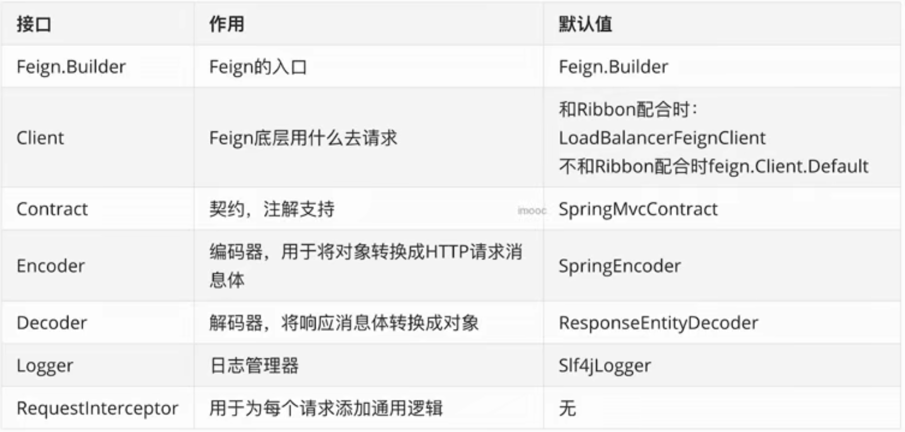
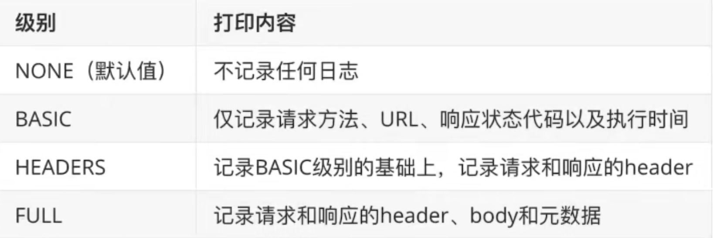
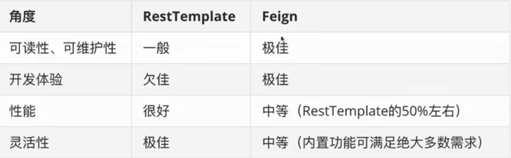

# Feign
Feign是从Netflix中分离出来的轻量级项目，能够在类接口上添加注释，成为一个REST API 客户端。

# 实际项目-使用Feign
<!-- more -->
## 加依赖

```
 <dependency>
            <groupId>org.springframework.cloud</groupId>
            <artifactId>spring-cloud-starter-openfeign</artifactId>
</dependency>

```


## 写注解
在启动类上加入`@EnableFeignClients` 注解


##  使用，编写远程 HTTP 调用

1. 编写一个接口，在接口上使用` @FeignClient(name =" user-center")`
2. 在接口里面定义 请求方法。
3. 在controller 里面使用接口去请求 ——> 接口会自动调用Feign 去访问。

> 声明式得HTTP 客户端-> 你只要声明一个接口，客户端会自动
去请求地址，使得编写变得简单。

## 组成


## 细粒度配置自定义

## 自定义 Feign 日志级别
Feign 是默认不打印任何日志得，而且 Feign 自定义了日志级别

其中 FULL 适合开发环境。现在配置环境


1. Java代码方式


2. 配置属性方式配置

##  使用 Java 代码的方式配置


1. 在 接口上注解中添加参数  configuration = “[日记配置包地址]”。
2. 创建FeignConfiguration 类 里面编写具体代码。

```
public class UserCenterFeignConfiguration{

    @Bean
    public Logger.Level level(){
        // 让 feign 打印所有请求得细节。
        return Logger.Level.FULL;
    }
}
```
> 注意：不要在类上添加 @Configuration 加上注解 所有Fegin 会共享该配置。

3. 在logger.level 下面将接口包地址加上。

## 二，使用配置属性配置Feign

` feign.clent.config.<feignName>.loggerLevel:full `

在项目配置文件中添加上面这行配置就行。

## 三，全局配置自定义

## 使用 Java 代码的方式配置
1. 让父子上下文重叠(添加@Configuration，强烈不推荐)
2. @EableFeignClients(defaultConfiguration=xxx.class)

## Feign 支持的配置项
## 支持

# 最佳实践
1. 尽量使用属性配置，属性实现不了的情况下再考虑用代码配置。
2. 再同一个微服务类尽量保持单一性，比如统一使用属性配置，不要两种方式混用，增加定位代码的复杂性。

# Feign 继承
# Feign 多参数请求构造
1. GET
假设需请求的URL包含多个参数，例如http://microservice-provider-user/get?id=1&username=张三 ，该如何使用Feign构造呢？

```
@FeignClient("microservice-provider-user")
public interface UserFeignClient {
  @GetMapping("/get")
  public User get0(@SpringQueryMap User user);
}

```

2. POST

# Feign 脱离 Ribbon 使用
在@FeignClient 注解上添加参数Url
```
@FeignClient(name = "baidu",url="http://www.baidu.com")
public interface TestBaiduFeignClient{

    @GetMapping("/baidu")
    String index();
}

```
# RestTempate vs Feign
