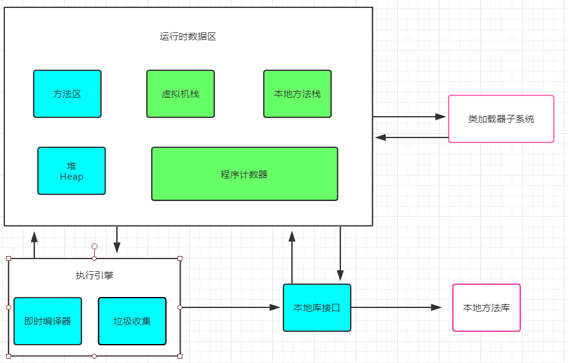

 ###前言 
 一些从网上找到德笔试题目。  

<!-- more -->


# 笔试题
只是纪录 正确答案和知识点。
## 1. 下列那些情况下会导致中断或者停止运行
1. InterruptedException异常被捕获
2. 线程使用了 wait 方法

## 2. Java JVM
1. 运行时内存分为“线程共享”和“线程私有”两部分，以下哪些属于“线程共享”部分
2. 线程私有部分：Java 虚拟机栈，程序计数器，本地方法区
线程共享部分：Java 堆，方法区。


3. Java 的垃圾回收器（GC）主要针对堆区
4. 对于一个对象来说，只要有强引用的存在，它就会一直存在于内存中
如果一个对象仅持有虚引用，那么它就和没有任何引用一样，在任何时候都可能被垃圾回收器回收。
如果一个对象只具有软引用，则内存空间足够，垃圾回收器就不会回收它；如果内存空间不足了，就会回收这些对象的内存
一旦发现了只具有弱引用的对象，不管当前内存空间足够与否，都会回收它的空间


## Java 关键字 
Java的关键字对Java的编译器有特殊的意义，他们用来表示一种数据类型，或者表示程序的结构等，关键字不能用作变量名、方法名、类名、包名和参数。  
true false 是boolean的变量值，是编译器赋予特定含义的，但并不是关键字

## Java 反射
**反射的本质**就是从字节码中查找，动态获取类的整容结构，包括属性，构造器，动态调用对象的方法，而不是修剪类

## Java 异常
1. 有时为了避免某些未识别的异常抛给更高的上层应用，在某些接口实现中我们通常需要捕获编译运行期所有的异常， catch 下述哪个类的实例才能达到目的
2. 下面哪个行为被打断不会导致InterruptedException

3. error是系统出错，catch是无法处理的，难以修复的，RuntimeException不需要程序员进行捕获处理，error和exception都是throwable的子类，我们只需要对exception的实例进行捕获即可
4. InterruptedException 当线程在活动之前或活动期间处于正在等待、休眠或占用状态且该线程被中断时，抛出该异常


## Java 基础


## 数据类型转换问题
由大到小需要强制转换，由小到大不需要。
> long → float  无须强制转换
> 浮点数的32位并不是简单直接表示大小，而是按照一定标准分配的。
取模运算，余数的符号跟被除数符号相同

## Hashtable 和 HashMap 的区别是：
Hashtable ：
1. 是一个散列表，存储的内容是键值对映射。
2.  线程安全，key，value 都不可以为空。
3. HashMap 直接计算对象的hashCode
4. 继承 Dictionary 实现Map

HashMap 
1. 是内部基于哈希表实现，该类继承AbstractMap，实现Map接口
2. 由链表+数组组成，基于哈希表Map 实现。
3. 不是线程安全的，HashMap可以接受为null的键(key)和值(value)。
4. HashMap重新计算hash值

## 抽象类和接口
1. 抽象类是可以实现接口的，而且抽象类也可以继承自抽象类
2. 抽象类和接口都是不能被实例化的，只有具体的类才可以被实例化

```
String s="welcome"+"to"+360;
创建 一个对象。
```

